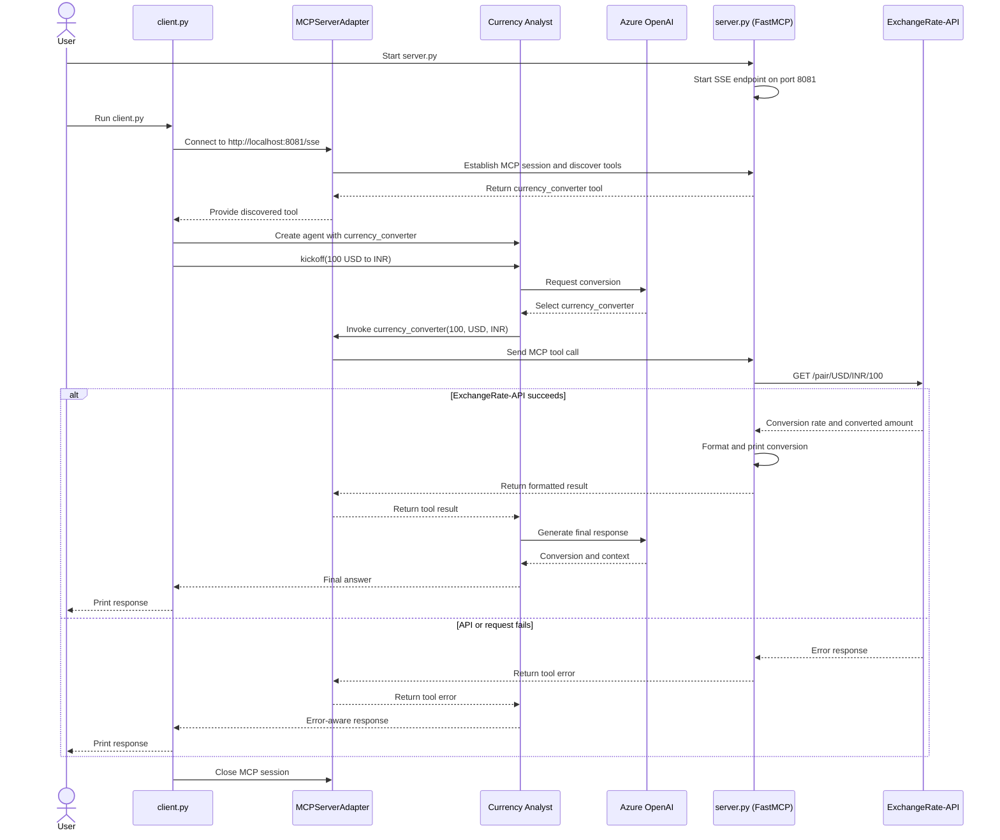

## What is an AI Agent?
* Generate a report on the latest trends in AI research. If you use a standard LLM, you might:
  1. Ask for a summary of recent AI research papers.
  2. Review the response and realize you need sources.
  3. Obtain a list of papers along with citations.
  4. Find that some sources are outdated, so you refine your query.
  5. Finally, after multiple iterations, you get a useful output.
  

* This iterative process takes time and effort, requiring you to act as the decision-maker at every step.

* How AI agents handle this differently:
  * A Research Agent autonomously searches and retrieves relevant AI research papers from arXiv, Semantic Scholar, or Google Scholar.
    
      * A Filtering Agent scans the retrieved papers, identifying the most relevant ones based on citation count, publication date, and keywords.
          
      * A Summarization Agent extracts key insights and condenses them into an easy-to-read report.
          
      * A Formatting Agent structures the final report, ensuring it follows a clear, professional layout.
          

* AI agents not only execute the research process end-to-end but also self-refine their outputs, ensuring the final report is comprehensive, up-to-date, and well-structured - all without requiring human intervention at every step.
  

* AI Agents are autonomous systems that can reason, think, plan, figure out the relevant sources and extract information from them when needed, take actions, and even correct themselves if something goes wrong.

## Agent vs LLM vs RAG
* LLM is the brain.
* RAG is feeding that brain with fresh information.
* An agent is the decision-maker that plans and acts using the brain and the tools.

### LLM (Large Language Model)
* An LLM like GPT-4 is trained on massive text data.
* It can reason, generate, summarize but only using what it already knows (i.e., its training data).
* It’s smart, but static. It can’t access the web, call APIs, or fetch new facts on its own.

### RAG (Retrieval-Augmented Generation)
* RAG enhances an LLM by retrieving external documents (from a vector DB, search engine, etc.) and feeding them into the LLM as context before generating a response.
* RAG makes the LLM aware of updated, relevant info without retraining.

### Agent
* An Agent adds autonomy to the mix.
* It doesn’t just answer a question—it decides what steps to take: Should it call a tool? Search the web? Summarize? Store info?
* An Agent uses an LLM, calls tools, makes decisions, and orchestrates workflows just like a real assistant.

## Building blocks of AI Agents
* 6 essential building blocks that make AI agents more reliable, intelligent, and useful in real-world applications:
  1. Role-playing
  2. Focus
  3. Tools
  4. Cooperation
  5. Guardrails
  6. Memory

### 1) Role-playing
* Boost an agent’s performance is by giving it a clear, specific role.
* A generic AI assistant may give vague answers. But define it as a “Senior contract lawyer,” and it responds with legal precision and context.
* Why? Because role assignment shapes the agent’s reasoning and retrieval process. The more specific the role, the sharper and more relevant the output.
  

### 2) Focus/Tasks
* Focus is key to reducing hallucinations and improving accuracy.
* Giving an agent too many tasks or too much data doesn’t help - it hurts.
* Overloading leads to confusion, inconsistency, and poor results.
* For example, a marketing agent should stick to messaging, tone, and audience not pricing or market analysis.
* Instead of trying to make one agent do everything, a better approach is to use multiple agents, each with a specific and narrow focus.
* Specialized agents perform better - every time.
  

### 3) Tools
* Agents get smarter when they can use the right tools.
* But more tools ≠ better results.
* For example, an AI research agent could benefit from:
  * A web search tool for retrieving recent publications.
  * A summarization model for condensing long research papers.
  * A citation manager to properly format references.
  

* But if you add unnecessary tools—like a speech-to-text module or a code execution environment—it could confuse the agent and reduce efficiency.
  
#### 3.1) Custom tools
* While LLM-powered agents are great at reasoning and generating responses, they lack direct access to real-time information, external systems, and specialized computations.
* Tools allow the Agent to:
  * Search the web for real-time data.
  * Retrieve structured information from APIs and databases.
  * Execute code to perform calculations or data transformations.
  * Analyze images, PDFs, and documents beyond just text inputs.
* CrewAI supports several tools that you can integrate with Agents, as depicted below:
  

* In this example, we're building a real-time currency conversion tool inside CrewAI.
  * Instead of making an LLM guess exchange rates, we integrate a custom tool that fetches live exchange rates from an external API and provides some insights.
    ```
    installed the tools package ``` pip install crewai-tools ```
    get api key - https://www.exchangerate-api.com/

    index.py
    # 1. standard import statements:
    from dotenv import load_dotenv
    load_dotenv()
    import os, requests
    from typing import Type
    from crewai.tools import BaseTool
    from pydantic import BaseModel, Field
    
    # 2 define the input fields the tool expects using Pydantic.
    class CurrencyConverterInput(BaseModel):
        from_currency: str = Field(..., description="The currency code to convert from (e.g USD)")
        to_currency: str = Field(..., description="The currency code to convert to (e.g EUR)")
        amount: float = Field(..., description="The amount of currency to convert")
    
    # 3 define the CurrencyConverterTool by inheriting from BaseTool:
    class CurrencyConverterTool(BaseTool):
        name : str = "Currency Converter Tool"
        description : str= "A tool to convert amount from one type of currency to another"
        input_model: Type[BaseModel] = CurrencyConverterInput
        api_key: str = "asdasdasds" #os.getenv("EXCHANGE_RATE_API_KEY")
    
        # 4 Every tool class should have the _run method which we will execute whenever the Agents wants to make use of it.
        def _run(self, amount: float, from_currency: str, to_currency: str) -> str:
            url = f"https://v6.exchangerate-api.com/v6/{self.api_key}/latest/{from_currency}"
            print(url)
            response = requests.get(url)
            data = response.json()
            if data["result"] == "success":
                rate =  amount * data["conversion_rates"][to_currency]
                return f"{amount} {from_currency} is equal to {rate:.2f} {to_currency}"
            else:
                raise ValueError("Failed to convert currency")
    
    # 5. define an agent that uses the tool for real-time currency analysis and
    # attach our CurrencyConverterTool, allowing the agent to call it directly if needed:
    
    from crewai import Agent, LLM
    
    llm = LLM(
        model="EGPT-4.1",
        api_key="asdd",
        base_url="https://eus2.openai.azure.com/openai/v1"
    )
    
    currency_analyst_agent = Agent(
        role="Currency Analyst",
        goal="Provide real time currency conversion rates and financial insights",
        backstory=(
            "You are a financial expert with deep knowledge of global exchange rates. "
            "You help users with currency conversion and financial decision-making."
        ),
        tools=[CurrencyConverterTool()],
        llm=llm,
        verbose=True,
    )
    
    # 6. assign a task to the currency_analyst agent.
    
    from crewai import Task
    
    currency_conversion_task = Task(
        description=(
            "Convert {amount} {from_currency} to {to_currency} using real-time exchange rates. "
            "Provide the equivalent amount and explain any relevant financial context."
        ),
        expected_output= "A detailed response including the converted amount and financial insights.",
        agent=currency_analyst_agent
    )
    
    # 7. we create a Crew, assign the agent to the task, and execute it.
    
    from crewai import Crew, Process
    
    crew = Crew(
        agents=[currency_analyst_agent],
        tasks=[currency_conversion_task],
        process=Process.sequential
    )
    
    response = crew.kickoff(inputs={
        "amount": 100,
        "from_currency": "USD",
        "to_currency": "EUR"
    })
    
    print(response)
    ```
    

    ```mermaid
    sequenceDiagram
    actor User
    participant Script as index.py
    participant Crew
    participant Agent as Currency Analyst
    participant LLM
    participant Tool as Currency Converter Tool
    participant API as ExchangeRate API

    User->>Script: Run script
    Script->>Script: Load .env
    Script->>Crew: kickoff(amount, from_currency, to_currency)
    Crew->>Agent: Execute currency conversion task
    Agent->>LLM: Request conversion and financial context
    LLM-->>Agent: Decide to use currency converter tool
    Agent->>Tool: _run(amount, from_currency, to_currency)
    Tool->>API: GET /latest/{from_currency}
    API-->>Tool: Exchange rates JSON

    alt API result is success
        Tool->>Tool: Calculate amount × conversion rate
        Tool-->>Agent: Converted amount
        Agent->>LLM: Prepare response with conversion result
        LLM-->>Agent: Detailed response
        Agent-->>Crew: Task result
        Crew-->>Script: Final response
        Script-->>User: Print response
    else API request fails
        Tool-->>Agent: Raise ValueError
        Agent-->>Crew: Task failure
        Crew-->>Script: Error
        Script-->>User: Execution error
    end
    ```

#### 3.2) Custom tools via MCP
* Instead of embedding the tool directly in every Crew, we’ll expose it as a reusable MCP tool—making it accessible across multiple agents and flows via a simple server.
1. install the required packages: ``` pip install mcp-server requests python-dotenv  mcp "crewai-tools[mcp]" ```

```
# 1. server.py - lightweight script that exposes the currency converter tool

import os, requests
import dotenv
dotenv.load_dotenv()
from mcp.server.fastmcp import FastMCP

mcp = FastMCP('currency_converter-server', port=8081)
api_key = "123213" #os.getenv("EXCHANGE_RATE_API_KEY")

# 2. define the tool logic with @mcp.tool

@mcp.tool()
def currency_converter(amount: float, from_currency: str, to_currency: str) -> str:
    if not api_key:
        raise ValueError("EXCHANGE_RATE_API_KEY is not set")

    url = f"https://v6.exchangerate-api.com/v6/{api_key}/pair/{from_currency}/{to_currency}/{amount}"
    response = requests.get(url, timeout=15)
    response.raise_for_status()
    response_data = response.json()
    if response_data.get("result") != "success":
        raise ValueError(f"Currency conversion failed: {response_data.get('error-type', 'unknown API error')}")

    rate = response_data["conversion_rate"]
    result = response_data["conversion_result"]
    print(f"{amount} {from_currency.upper()} = {result:.2f} {to_currency.upper()} (Rate: {rate:.4f})")
    return f"{amount} {from_currency.upper()} = {result:.2f} {to_currency.upper()} (Rate: {rate:.4f})"

# 3. To make the tool accessible, run the MCP server. 

if __name__ == "__main__":
    mcp.run(transport="sse")

# 4.This starts the server and exposes your convert_currency tool at:http://localhost:8081/sse.
```

```
# 5. Now any CrewAI agent can connect to it using MCPServerAdapter. ow consume this tool from within a CrewAI agent.

import os

from dotenv import load_dotenv
from crewai import Agent, Task, Crew, LLM
from crewai_tools import MCPServerAdapter

load_dotenv()

# 6. connect to the MCP tool server. Define the server parameters to connect to your running tool (from server.py).

server_params = {
    "url": "http://localhost:8081/sse",
    "transport": "sse"
}

# 8. Now we use the discovered MCP tool in an agent:
# This agent is assigned the convert_currency tool from the remote server. 
# It can now call the tool just like a locally defined one.

azure_openai_api_key = "1231" #os.getenv("AZURE_OPENAI_API_KEY")
if not azure_openai_api_key:
    raise ValueError("AZURE_OPENAI_API_KEY is not set")

llm = LLM(
    model="EGPT-4.1",
    api_key=azure_openai_api_key,
    base_url="https://es2.openai.azure.com/openai/v1"
)

with MCPServerAdapter(server_params) as mcp_tools:
    currency_agent = Agent(
        role="Currency Analyst",
        goal="Convert currency using real-time exchange rates",
        backstory="You help users convert between currencies using up-to-date market data.",
        allow_delegation=False,
        tools=[mcp_tools["currency_converter"]],
        llm=llm,
    )

    # 9. Give the agent a task description.
    conversion_task = Task(
        description=(
            "Convert {amount} {from_currency} to {to_currency} using real-time exchange rates. "
            "Provide the equivalent amount and explain any relevant financial context."
        ),
        expected_output="A formatted result with exchange rate.",
        agent=currency_agent,
    )

    # 10. Run the crew before the adapter closes the MCP connection.
    crew = Crew(
        agents=[currency_agent],
        tasks=[conversion_task],
        verbose=True,
    )

    response = crew.kickoff(inputs={
        "amount": 100,
        "from_currency": "USD",
        "to_currency": "INR",
    })

    print(response)
```



4) Cooperation
Multi-agent systems work best when agents collaborate and exchange feedback.
Instead of one agent doing everything, a team of specialized agents can split tasks
and improve each other’s outputs.

Consider an AI-powered financial analysis system:
● One agent gathers data
● another assesses risk,
● a third builds strategy,
● and a fourth writes the report
Collaboration leads to smarter, more accurate results.
The best practice is to enable agent collaboration by designing workflows where
agents can exchange insights and refine their responses together.

21

DailyDoseofDS.com

5) Guardrails
Agents are powerful but without constraints, they can go off track. They might
hallucinate, loop endlessly, or make bad calls.
Guardrails ensure that agents stay on track and maintain quality standards.

Examples of useful guardrails include:
● Limiting tool usage: Prevent an agent from overusing APIs or generating
irrelevant queries.
● Setting validation checkpoints: Ensure outputs meet predefined criteria
before moving to the next step.
● Establishing fallback mechanisms: If an agent fails to complete a task,
another agent or human reviewer can intervene.
For example, an AI-powered legal assistant should avoid outdated laws or false
claims - guardrails ensure that.
6) Memory
Finally, we have memory, which is one of the most critical components of AI
agents.

22

DailyDoseofDS.com
Without memory, an agent would start fresh every time, losing all context from
previous interactions. With memory, agents can improve over time, remember
past actions, and create more cohesive responses.

Different types of memory in AI agents include:
● Short-term memory – Exists only during execution (e.g., recalling recent
conversation history).
● Long-term memory – Persists after execution (e.g., remembering user
preferences over multiple interactions).
● Entity memory – Stores information about key subjects discussed (e.g.,
tracking customer details in a CRM agent).
For example, in an AI-powered tutoring system, memory allows the agent to
recall past lessons, tailor feedback, and avoid repetition.
