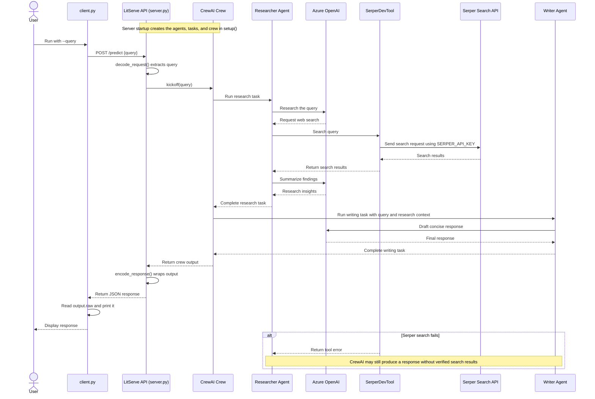

## 1) Agentic RAG
* Build a RAG pipeline with agentic capabilities that can dynamically fetch context from different sources, like a vector DB and the internet.
  


* Tech stack:
  * CrewAI for Agent orchestration.
  * Firecrawl for web search. or [SerperDevToo - Google Search APIl](https://serper.dev/)
  * LightningAI's LitServe for deployment.

* Workflow:
  * The Retriever Agent accepts the user query.
  * It invokes a relevant tool (Firecrawl web search or vector DB tool) to get
context and generate insights.
  * The Writer Agent generates a response.

* Difference between Previous Client.py and server.py
  * (here Server.py) SerperDevTool is a CrewAI tool for web search. The researcher agent calls it to query Serper; it is not itself an MCP server.
  * AgenticRAGAPI(ls.LitAPI) defines and hosts your LitServe API. LitServe can expose that API through its MCP connector, but that behavior comes from LitServe, not from SerperDevTool.
  * (Previous Client.py) MCPServerAdapter is an MCP client adapter. It connects to an existing MCP server, discovers its tools, and makes them available to a CrewAI agent. The with block keeps that connection alive while the crew runs.
  * So, in the currency example, FastMCP(...).run(transport="sse") is the MCP server and MCPServerAdapter in client.py is its client.
  * In the LitServe example, server.py hosts the API and may expose it as MCP through LitServe.
  * One practical distinction: the adapter’s http://localhost:8081/sse URL is for the FastMCP SSE server. Don’t assume LitServe’s MCP endpoint uses that same URL or transport.

if SERPER_API_KEY is missing, then flow is
  * client.py only sends the query to LitServe and prints the response. It does not call Serper itself:
    * The client POSTs to http://127.0.0.1:8000/predict.
    * The server runs the CrewAI workflow. The researcher agent tries SerperDevTool.
    * If Serper fails because SERPER_API_KEY is missing, CrewAI can still continue. The LLM may answer from its existing knowledge, and the writer agent can return that as the final result.
    * LitServe returns the result, which the client prints from output.raw.
  * So seeing an answer means the API returned a response; it doesn’t mean the web search succeeded. That answer may be unverified

* CrewAI
  * CrewAI is a Python framework for building applications where AI agents work together on tasks.
  * You define agents with roles and tools, give them tasks, then group them into a crew that coordinates the workflow.
  * In your project, the Researcher agent is meant to search the web with SerperDevTool,
  * and the Writer agent turns the findings into a response.
  * LitServe exposes that workflow as an HTTP API; client.py sends it a query.
 
| | SerperDevTool |	FirecrawlWebSearchTool |
| - | - | - |
| Provider	| Serper, which returns Google search results	| Firecrawl
| Typical result	| Search-result titles, links, and snippets	| Search results and, depending on its implementation, extracted page content
| Useful | when	You want a straightforward Google-style web search	| You want web search as part of a Firecrawl-based extraction or RAG workflow
| Credentials	| SERPER_API_KEY	| Usually FIRECRAWL_API_KEY

* In your code, SerperDevTool comes from crewai_tools, while FirecrawlWebSearchTool is imported from your project’s tools module.
* So its exact behavior depends on how you implemented that wrapper. Neither tool is an MCP server; they’re tools the Researcher agent can use.

```
pip install crewai crewai-tools litserve fastmcp 
pip install --upgrade "mcp~=1.28.1" "fastmcp<3"
```

```
# server.py
# 1. Set up LLM - CrewAI integrates with all popular LLMs. set up a local Qwen 3 via Ollama:

from crewai import Crew, Agent, Task, LLM
import litserve as ls
import os
from crewai_tools import SerperDevTool

# If you'd like, you can use a local LLM as well through Ollama. Do this:
# ollama pull qwen3 in the command line.

# Uncomment the following line and also the llm=llm line in the Agents definitions.
# llm = LLM(model="ollama/qwen3")

azure_openai_api_key = "asdasd" #os.getenv("AZURE_OPENAI_API_KEY")

SERPER_API_KEY= "asdad"

os.environ["SERPER_API_KEY"] = SERPER_API_KEY
    
llm = LLM(
    model="EGPT-4.1",
    api_key=azure_openai_api_key,
    base_url="https://eus2.openai.azure.com/openai/v1"
)

class AgenticRAGAPI(ls.LitAPI):
    def setup(self, device):

#2. Define Research Agent and Task 
# This Agent accepts the user query and retrieves the relevant context using a VectorDB tool and a web search tool powered by Firecrawl. 
# Again, put this in the LitServe setup() method: 

        researcher_agent = Agent(
            role="Researcher",
            goal="Research about the user's query and generate insights",
            backstory="You are a helpful assistant that can answer questions about the document.",
            verbose=True,
            tools=[SerperDevTool()],
            llm=llm
        )
        
        researcher_task = Task(
            description="Research about the user's query and generate insights: {query}",
            expected_output="A concise and informative report about the user's query",
            agent=researcher_agent,
        )

#3) Define Writer Agent and Task 
# the Writer Agent accepts the insights from the Researcher Agent to generate a response.  
# Yet again, we add this in the LitServe setup method: 

        writer_agent = Agent(
            role="Writer",
            goal="Use the available insights to write a concise and informative response to the user's query",
            backstory="You are a helpful assistant that can write a report about the user's query",
            verbose=True,
            llm=llm
        )
        
        writer_task = Task(
            description="Use the available insights to write a concise and informative response to the user's query: {query}",
            expected_output="A concise and informative response to the user's query",
            agent=writer_agent,
        )

# 4) Set up the Crew 
# Once we have defined the Agents and their tasks, we orchestrate them into a crew using CrewAI and put that into a setup method.  

        self.crew = Crew(
            agents=[researcher_agent, writer_agent],
            tasks=[researcher_task, writer_task],
            verbose=True,
        )

#5) Decode request 
# With that, we have orchestrated the Agentic RAG workflow, which will be executed upon an incoming request.
# Next, from the incoming request body, we extract the user query.

    def decode_request(self, request):
        return request["query"]

# 6) Predict - We use the decoded user query and pass it to the Crew defined earlier to generate a response from the model. 

    def predict(self, query):
        return self.crew.kickoff(inputs={"query": query})

# 7) Encode response 
# Here, we can post-process the response & send it back to the client. 
# Note: LitServe internally invokes these methods in order: decode_request → predict → encode_request. 

    def encode_response(self, output):
        return {"output": output}

if __name__ == "__main__":
    api = AgenticRAGAPI()
    server = ls.LitServer(api)
    server.run(port=8000)
    

# 8) Next, we have the basic client.py code to invoke the API we created using the requests Python library.
```
```
# client.py
import requests, json, argparse, time

# replace this URL with your exposed URL from the API builder. The URL looks like this
SERVER_URL = 'http://127.0.0.1:8000'

def main():
    parser = argparse.ArgumentParser(description="Send a query to the LitServe server.")
    parser.add_argument("--query", type=str, required=True, help="The query text to send to the server.")
    
    args = parser.parse_args()
    
    payload = {
        "query": args.query
    }
    
    try:
        response = requests.post(f"{SERVER_URL}/predict", json=payload)
        response.raise_for_status()  # Raise an exception for bad status codes
        
        result = response.json()['output']['raw']
        for token in result.split():
            print(token, end=" ", flush=True)
            time.sleep(0.05)

        # print(json.dumps(result, indent=2))
    except requests.exceptions.RequestException as e:
        print(f"Error sending request: {e}")

if __name__ == "__main__":
    main()
```




