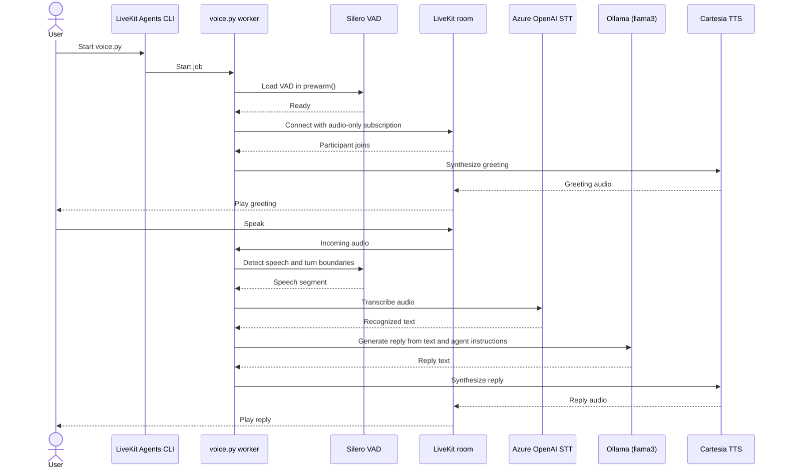
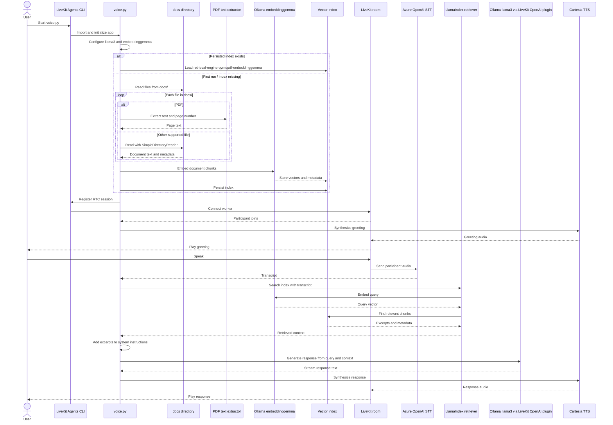

* Tech stack: 
  * CartesiaAI for SOTA text-to-speech
  * AssemblyAI for speech-to-text
  * LlamaIndex to power RAG
  * Livekit for orchestration 
* Workflow:
  * Listens to real-time audio
  * Transcribes it via AssemblyAI - a leading speech-to-text platform.
  * Uses your docs (via LlamaIndex) to craft an answer
  * Speaks that answer back with Cartesia - a platform to generate seamless speech, power voice apps, and fine-tune your own voice models in near real-time.

```
requirements.txt

cartesia
livekit
livekit-agents
livekit-api
livekit-plugins-assemblyai
livekit-plugins-cartesia
livekit-plugins-deepgram
livekit-plugins-llama-index
livekit-plugins-openai
livekit-plugins-silero
livekit-protocol
llama-index-core
llama-index-llms-ollama
llama-index-llms-openai
openai
python-dotenv
llama-index-embeddings-openai
llama-index-embeddings-huggingface
llama-index-embeddings-ollama
```
```
.env

AZURE_OPENAI_API_KEY=sdfsfd

AZURE_OPENAI_ENDPOINT_LLM=https://eus2.openai.azure.com/openai/v1
AZURE_OPENAI_DEPLOYMENT_NAME_LLM=EGPT-4.1

AZURE_OPENAI_ENDPOINT_STT=https://eus2.openai.azure.com/openai/deployments/gpt-4o-transcribe/audio/transcriptions?api-version=2025-03-01-preview
AZURE_OPENAI_STT_DEPLOYMENT=gpt-4o-transcribe
AZURE_OPENAI_STT_MODEL=gpt-4o-transcribe

AZURE_OPENAI_ENDPOINT_TTS=https://eus2.openai.azure.com/openai/deployments/gpt-4o-mini-tts/audio/speech?api-version=2025-03-01-preview
AZURE_OPENAI_DEPLOYMENT_NAME_TTS=gpt-4o-mini-tts

LIVEKIT_URL=wss://mak-mcp-learm-xvguqd5g.livekit.cloud
LIVEKIT_API_KEY=sdfdsf
LIVEKIT_API_SECRET=sdfsdf

CARTESIA_API_KEY=sk_car_sfsdff
```

```
voice.py - code without RAG

import logging
import os
from dotenv import load_dotenv
from livekit.agents import Agent, AgentSession, JobContext, JobProcess, WorkerOptions, cli
from livekit.agents.job import AutoSubscribe
from livekit.plugins import cartesia, openai, silero

Settings.embed_model = embed_model

load_dotenv()

# create a logger for the voice assistant
logger = logging.getLogger("voice-assistant")
logger.setLevel(logging.INFO)

# 3) setup Voice Activity Detection (VAD)
# want VAD for smooth real-time experience, so we’ll “prewarm” the Silero VAD model.
# This helps us detect when someone is actually speaking.
def prewarm(proc: JobProcess):
    proc.userdata["vad"] = silero.VAD.load()
    logger.info("Silero VAD model prewarmed and ready")

async def entrypoint(ctx: JobContext):

    logger.info(f"Connecting to room {ctx.room.name}")
    await ctx.connect(auto_subscribe=AutoSubscribe.AUDIO_ONLY)

    participant = await ctx.wait_for_participant()
    logger.info(f"Starting voice assistant for participant {participant.identity}")

    # 4) The VoicePipelineAgent and Entry Point,  The agent: 
    #   1. Listens to real-time audio. 
    #   2. Transcribes it using AssemblyAI. 
    #   3. Craft an answer with your documents via LlamaIndex. 
    #   4. Speaks that answer back using Cartesia.
    session = AgentSession(
        vad=ctx.proc.userdata["vad"],
        #stt=openai.STT(),
        # OR
        #stt = addemblyai.STT()
        # OR
        stt=openai.STT.with_azure(
            model=os.getenv("AZURE_OPENAI_STT_MODEL"),
            azure_deployment=os.getenv("AZURE_OPENAI_STT_DEPLOYMENT"),
            azure_endpoint=os.getenv("AZURE_OPENAI_ENDPOINT_STT"),
            api_key=os.getenv("AZURE_OPENAI_API_KEY"),
            api_version=os.getenv("AZURE_OPENAI_STT_API_VERSION", "2025-03-01-preview"),
        ),

        llm=openai.LLM.with_ollama(
            model="llama3"
            #base_url=os.getenv("OLLAMA_BASE_URL", "http://localhost:11434/v1"),
        ),
        #llm=openai.LLM(
        #       model=os.getenv("AZURE_OPENAI_DEPLOYMENT_NAME_LLM"),
        #        api_key=os.getenv("AZURE_OPENAI_API_KEY"),
        #        base_url=os.getenv("AZURE_OPENAI_ENDPOINT_LLM"),
        #),

        #text to speech
        tts=cartesia.TTS(
            model="sonic-2",
            voice="bf0a246a-8642-498a-9950-80c35e9276b5",
        ),
        #tts=openai.TTS.with_azure(
        #    azure_deployment=os.getenv("AZURE_OPENAI_DEPLOYMENT_NAME_TTS"),
        #    model=os.getenv("AZURE_OPENAI_DEPLOYMENT_NAME_TTS"),
        #    voice=os.getenv("AZURE_OPENAI_TTS_VOICE", "alloy"),
        #    azure_endpoint=os.getenv("AZURE_OPENAI_ENDPOINT_TTS"),
        #    api_key=os.getenv("AZURE_OPENAI_API_KEY"),
        #    api_version=os.getenv("AZURE_OPENAI_TTS_API_VERSION", "2025-03-01-preview"),
        #),
    )

    agent = Agent(
        instructions=(
            "You are a funny, witty assistant. "
            "Respond with short, concise answers. Avoid unpronounceable punctuation or emojis."
        ),
    )

    await session.start(room=ctx.room, agent=agent)

    await session.say(
        "Hey there! How can I help you today?",
        allow_interruptions=True,
    )


if __name__ == "__main__":
    print("Starting voice agent...")
    cli.run_app(
        WorkerOptions(
            entrypoint_fnc=entrypoint,
            prewarm_fnc=prewarm,
        ),
    )
```




```
voice.py

#2) Setup RAG 
This is where your documents get indexed for search and retrieval, powered by LlamaIndex. The agent's answers would be grounded to this knowledge base.  

import logging, os
from pathlib import Path
from collections.abc import AsyncIterable
from dotenv import load_dotenv
from openai import AsyncOpenAI
from livekit.agents import Agent, AgentServer, AgentSession, AutoSubscribe, JobContext,  cli, llm
from livekit.agents.job import AutoSubscribe
from livekit.agents.types import APIConnectOptions
from livekit.plugins import cartesia, openai
from livekit.agents.voice.agent_session import SessionConnectOptions
import fitz

from llama_index.core import (
    Document,
    SimpleDirectoryReader,
    StorageContext,
    VectorStoreIndex,
    load_index_from_storage,
    Settings
)

from livekit.agents.voice.agent import ModelSettings
from llama_index.core.schema import MetadataMode
from llama_index.llms.ollama import Ollama
ollama_llm = Ollama(model="llama3")
Settings.llm = ollama_llm

from llama_index.embeddings.ollama import OllamaEmbedding
embed_model = OllamaEmbedding(model_name='embeddinggemma')

Settings.embed_model = embed_model

load_dotenv()

# create a logger for the voice assistant
logger = logging.getLogger("voice-assistant")
logger.setLevel(logging.INFO)

# Directory for persistent our index
print("RAG Start")
# check if storage already exists
THIS_DIR = Path(__file__).parent
PERSIST_DIR = THIS_DIR / "retrieval-engine-pymupdf-embeddinggemma"
if not PERSIST_DIR.exists():
    documents = []
    for source_path in (THIS_DIR / "docs").iterdir():
        if source_path.suffix.lower() == ".pdf":
            with fitz.open(source_path) as pdf:
                for page_number, page in enumerate(pdf, start=1):
                    text = page.get_text("text").strip()
                    if text:
                        documents.append(
                            Document(
                                text=text,
                                metadata={"file_name": source_path.name, "page": page_number},
                            )
                        )
        else:
            documents.extend(SimpleDirectoryReader(input_files=[str(source_path)]).load_data())

    if not documents:
        raise ValueError(f"No readable documents found in {THIS_DIR / 'docs'}")

    index = VectorStoreIndex.from_documents(documents)
    # store it for later
    index.storage_context.persist(persist_dir=PERSIST_DIR)
else:
    # load the existing index
    storage_context = StorageContext.from_defaults(persist_dir=PERSIST_DIR)
    index = load_index_from_storage(storage_context)
print("RAG End")


class RetrievalAgent(Agent):
    def __init__(self, index: VectorStoreIndex):
        super().__init__(
            instructions=(
                "You are a voice assistant created by LiveKit. Your interface "
                "with users will be voice. You should use short and concise "
                "responses, and avoiding usage of unpronouncable punctuation."
            ),
             stt=openai.STT.with_azure(
                model=os.getenv("AZURE_OPENAI_STT_MODEL"),
                azure_deployment=os.getenv("AZURE_OPENAI_STT_DEPLOYMENT"),
                azure_endpoint=os.getenv("AZURE_OPENAI_ENDPOINT_STT"),
                api_key=os.getenv("AZURE_OPENAI_API_KEY"),
                api_version=os.getenv("AZURE_OPENAI_STT_API_VERSION", "2025-03-01-preview"),
            ),
            llm=openai.LLM.with_ollama(
                model=os.getenv("OLLAMA_MODEL", "llama3"),
                base_url=os.getenv("OLLAMA_BASE_URL", "http://localhost:11434/v1"),
                client=AsyncOpenAI(
                    base_url=os.getenv("OLLAMA_BASE_URL", "http://localhost:11434/v1"),
                    api_key="ollama",
                    timeout=60.0,
                ),
            ),
            tts=cartesia.TTS(
                model="sonic-2",
                voice="bf0a246a-8642-498a-9950-80c35e9276b5",
            ),
        )
        self.index = index

    async def llm_node(
        self,
        chat_ctx: llm.ChatContext,
        tools: list[llm.FunctionTool],
        model_settings: ModelSettings,
    ):
        user_msg = chat_ctx.items[-1]
        assert isinstance(user_msg, llm.ChatMessage) and user_msg.role == "user"
        user_query = user_msg.text_content
        assert user_query is not None

        retriever = self.index.as_retriever()
        nodes = await retriever.aretrieve(user_query)

        instructions = (
            "Answer the user's question using only the retrieved document excerpts below. "
            "If the excerpts do not contain the answer, say you could not find it in the documents. "
            "Do not substitute general knowledge. Retrieved excerpts:"
        )
        for node in nodes:
            node_content = node.get_content(metadata_mode=MetadataMode.LLM)
            instructions += f"\n\n{node_content}"

        # update the instructions for this turn, you may use some different methods
        # to inject the context into the chat_ctx that fits the LLM you are using
        system_msg = chat_ctx.items[0]
        if isinstance(system_msg, llm.ChatMessage) and system_msg.role == "system":
            # TODO(long): provide an api to update the instructions of chat_ctx
            system_msg.content.append(instructions)
        else:
            chat_ctx.items.insert(0, llm.ChatMessage(role="system", content=[instructions]))
        preview = instructions[:100].replace("\n", "\\n")
        print(f"update instructions: {preview}...")

        # update the instructions for agent
        # await self.update_instructions(instructions)

        return Agent.default.llm_node(self, chat_ctx, tools, model_settings)


server = AgentServer()


@server.rtc_session()
async def entrypoint(ctx: JobContext):
    await ctx.connect(auto_subscribe=AutoSubscribe.AUDIO_ONLY)

    agent = RetrievalAgent(index)
    session = AgentSession(
        conn_options=SessionConnectOptions(
            llm_conn_options=APIConnectOptions(max_retry=0, timeout=60.0),
        ),
    )
    await session.start(agent=agent, room=ctx.room)

    await session.say("Hey, how can I help you today?", allow_interruptions=False)


if __name__ == "__main__":
    cli.run_app(server)
```


