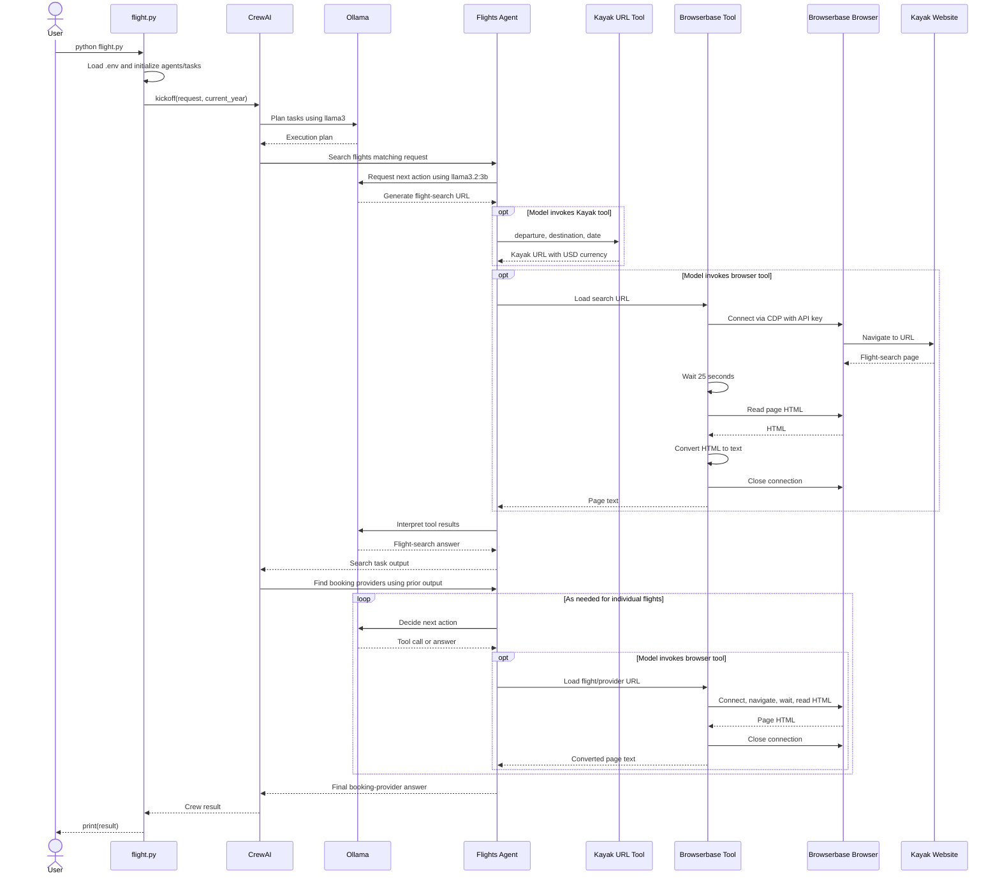

* Build a flight search pipeline with agentic capabilities that can parse NL queries and fetch live results from Kayak. 
* Tech stack:
  * CrewAIInc for multi-agent orchestration
  * BrowserbaseHQ's headless browser tool
  * Ollama to locally serve DeepSeek-R1 
* Workflow:
* Parse the query (SF to New York on 21st September) to create a Kayak search URL
* Visit the URL and extract top 5 flights
* For each flight, go to the details to find available airlines
* Summarize flight info

* 

```
requirments.txt
crewai
python-dotenv
playwright
html2text

.env
BROWSERBASE_API_KEY=bb_live_2asdads
```
```
flight.py

import sys
import datetime
from crewai import Crew, Task, Agent, LLM
from flight_browserbase import browserbase
from flight_kayak import kayak
from dotenv import load_dotenv

load_dotenv()  # take environment variables from .env.

llm32_3b = LLM(
        model="ollama/llama3.2:3b",
        base_url="http://localhost:11434"
    )

'''
#2) Flight Search Agent 
This agent mimics a real human searching for flights by browsing the web, 
powered by Browserbase’s headless-browser tool and can look up flights on sites like Kayak.
'''
flights_agent = Agent(
    role="Flights",
    goal="Search flights",
    backstory="I am an agent that can search for flights.",
    tools=[kayak, browserbase],
    allow_delegation=False,
    llm = llm32_3b
)

output_search_example = """
Here are our top 5 flights from San Francisco to New York on 21st September 2024:
1. Delta Airlines: Departure: 21:35, Arrival: 03:50, Duration: 6 hours 15 minutes, Price: $125, Details: https://www.kayak.com/flights/sfo/jfk/2024-09-21/12:45/13:55/2:10/delta/airlines/economy/1
"""

'''
#3) Summarisation Agent 
After retrieving the flight details, concise summary of all available options. 
Summarization Agent steps in to make sense of the results for easy reading.
'''
search_task = Task(
    description=(
        "Search flights according to criteria {request}. Current year: {current_year}"
    ),
    expected_output=output_search_example,
    agent=flights_agent,
)

summarize_agent = Agent(
    role="Summarize",
    goal="Summarize content",
    backstory="I am an agent that can summarize text.",
    allow_delegation=False,
    llm = llm32_3b
)

output_providers_example = """
Here are our top 5 picks from San Francisco to New York on 21st September 2024:
1. Delta Airlines:
    - Departure: 21:35
    - Arrival: 03:50
    - Duration: 6 hours 15 minutes
    - Price: $125
    - Booking: [Delta Airlines](https://www.kayak.com/flights/sfo/jfk/2024-09-21/12:45/13:55/2:10/delta/airlines/economy/1)
    ...
"""

search_booking_providers_task = Task(
    description="Load every flight individually and find available booking providers",
    expected_output=output_providers_example,
    agent=flights_agent,
)

crew = Crew(
    agents=[flights_agent, summarize_agent],
    tasks=[search_task, search_booking_providers_task],
    # let's cap the number of OpenAI requests as the Agents may have to do multiple costly calls with large context
    max_rpm=100,
    # verbose, planning=True to see the progress of the Agents and the Task execution. 
    # Remove these lines, run the script without seeing the progress (production).
    # planning = True is using the planning pattern we discussed in the Agentic AI Design Patterns above. 
    verbose=True,
    planning=True,
    planning_llm=llm32_3b
)

'''
#7) Kickoff and results 
Finally, we feed the user’s request (departure city, arrival city, travel dates) into the Crew 
'''
if __name__ == "__main__":
    result = crew.kickoff(
        inputs={
            "request": "flights from SF to New York on November 5th",
            "current_year": datetime.date.today().year,
        }
    )

    print(result)
```

```
flight_browserbase.py

'''
#5) Browserbase Tool 
The flight search agent uses the Browserbase tool to simulate human browsing and gather flight data. 
To be precise it automatically navigates the Kayak website and interacts with the web page.
'''
import os
from crewai.tools import tool
from playwright.sync_api import sync_playwright
from html2text import html2text
from time import sleep


@tool("Browserbase tool")
def browserbase(url: str):
    """
    Loads a URL using a headless webbrowser

    :param url: The URL to load
    :return: The text content of the page
    """
    with sync_playwright() as playwright:
        browser = playwright.chromium.connect_over_cdp(
            "wss://connect.browserbase.com?apiKey="
            + os.environ["BROWSERBASE_API_KEY"]
        )
        context = browser.contexts[0]
        page = context.pages[0]
        page.goto(url)

        # Wait for the flight search to finish
        sleep(25)

        content = html2text(page.content())
        browser.close()
        return content
```

```
flight_kayak.py

'''
#4) Kayak tool 
A custom Kayak tool to translate the user input into a valid Kayak search URL. 
(FYI Kayak is a popular fight and hotel booking)
'''

from crewai.tools import tool
from typing import Optional

@tool("Kayak tool")
def kayak_search(
    departure: str, destination: str, date: str, return_date: Optional[str] = None
) -> str:
    """
    Generates a Kayak URL for flights between departure and destination on the specified date.

    :param departure: The IATA code for the departure airport (e.g., 'SOF' for Sofia)
    :param destination: The IATA code for the destination airport (e.g., 'BER' for Berlin)
    :param date: The date of the flight in the format 'YYYY-MM-DD'
    :return_date: Only for two-way tickets. The date of return flight in the format 'YYYY-MM-DD'
    :return: The Kayak URL for the flight search
    """
    print(f"Generating Kayak URL for {departure} to {destination} on {date}")
    URL = f"https://www.kayak.com/flights/{departure}-{destination}/{date}"
    if return_date:
        URL += f"/{return_date}"
    URL += "?currency=USD"
    return URL

# Export the decorated function
kayak = kayak_search
```



```
(.venv) PS C:\mak\learn\VibeStudio> python flight.py
╭─────────────────────────────────────────────────────────────────────────────── 🚀 Crew Execution Started ────────────────────────────────────────────────────────────────────────────────╮
│                                                                                                                                                                                          │
│  Crew Execution Started                                                                                                                                                                  │
│  Name: crew                                                                                                                                                                              │
│  ID: a8467aad-b2db-43fc-901b-0712c420006a                                                                                                                                                │
│                                                                                                                                                                                          │
│                                                                                                                                                                                          │
╰──────────────────────────────────────────────────────────────────────────────────────────────────────────────────────────────────────────────────────────────────────────────────────────╯


[2026-10-06 10:09:41][INFO]: Planning the crew execution
╭──────────────────────────────────────────────────────────────────────────────────── 📋 Task Started ─────────────────────────────────────────────────────────────────────────────────────╮
│                                                                                                                                                                                          │
│  Task Started                                                                                                                                                                            │
│  Name: Based on these tasks summary:                                                                                                                                                     │
│                  Task Number 1 - Search flights according to criteria flights from SF to New York on November 5th. Current year: 2026                                                    │
│                  "task_description": Search flights according to criteria flights from SF to New York on November 5th. Current year: 2026                                                │
│                  "task_expected_output":                                                                                                                                                 │
│  Here are our top 5 flights from San Francisco to New York on 21st September 2024:                                                                                                       │
│  1. Delta Airlines: Departure: 21:35, Arrival: 03:50, Duration: 6 hours 15 minutes, Price: $125, Details:                                                                                │
│  https://www.kayak.com/flights/sfo/jfk/2024-09-21/12:45/13:55/2:10/delta/airlines/economy/1                                                                                              │
│                                                                                                                                                                                          │
│                  "agent": Flights                                                                                                                                                        │
│                  "agent_goal": Search flights                                                                                                                                            │
│                  "task_tools": [Tool(name='Kayak tool', description="\nGenerates a Kayak URL for flights between departure and destination on the specified date.\n\n:param departure:   │
│  The IATA code for the departure airport (e.g., 'SOF' for Sofia)\n:param destination: The IATA code for the destination airport (e.g., 'BER' for Berlin)\n:param date: The date of the   │
│  flight in the format 'YYYY-MM-DD'\n:return_date: Only for two-way tickets. The date of return flight in the format 'YYYY-MM-DD'\n:return: The Kayak URL for the flight search\n",       │
│  env_vars=[], args_schema=<class 'crewai.tools.base_tool.Kayaktool'>, result_schema=None, description_updated=False, cache_function=<function _default_cache_function at                 │
│  0x000001E089657B00>, result_as_answer=False, max_usage_count=None, tool_failure_policy=None, current_usage_count=0, func=<function kayak_search at 0x000001E0BB3EA200>,                 │
│  tool_type='crewai.tools.base_tool.Tool'), Tool(name='Browserbase tool', description='\nLoads a URL using a headless webbrowser\n\n:param url: The URL to load\n:return: The text        │
│  content of the page\n', env_vars=[], args_schema=<class 'crewai.tools.base_tool.Browserbasetool'>, result_schema=None, description_updated=False, cache_function=<function              │
│  _default_cache_function at 0x000001E089657B00>, result_as_answer=False, max_usage_count=None, tool_failure_policy=None, current_usage_count=0, func=<function browserbase at            │
│  0x000001E0BAFE7240>, tool_type='crewai.tools.base_tool.Tool')]                                                                                                                          │
│                  "agent_tools": [name='Kayak tool' description="\nGenerates a ...\n" ... tool_type='crewai.tools.base_tool.Tool', name='Browserbase tool' description='\nLoads\n' tool_type='crewai.tools.base_tool.Tool']                                                                                                                                                │
│                  Task Number 2 - Load every flight individually and find available booking providers                                                                                     │
│                  "task_description": Load every flight individually and find available booking providers                                                                                 │
│                  "task_expected_output":                                                                                                                                                 │
│  Here are our top 5 picks from San Francisco to New York on 21st September 2024:                                                                                                         │
│  1. Delta Airlines:                                                                                                                                                                      │
│      - Departure: 21:35                                                                                                                                                                  │
│      - Arrival: 03:50                                                                                                                                                                    │
│      - Duration: 6 hours 15 minutes                                                                                                                                                      │
│      - Price: $125                                                                                                                                                                       │
│      - Booking: [Delta Airlines](https://www.kayak.com/flights/sfo/jfk/2024-09-21/12:45/13:55/2:10/delta/airlines/economy/1)                                                             │
│      ...                                                                                                                                                                                 │
│                                                                                                                                                                                          │
│                  "agent": Flights                                                                                                                                                        │
│                  "agent_goal": Search flights                                                                                                                                            │
│                  "task_tools": [Tool(name='Kayak tool', description="\nGenerates a ...\" ... tool_type='crewai.tools.base_tool.Tool')]                                                                                                                          │
│                  "agent_tools": [name='Kayak tool' description="\nGenerates ... \n' ...   tool_type='crewai.tools.base_tool.Tool']                                                                                                                                                │
│   Create the most descriptive plan based on the tasks descriptions, tools available, and agents' goals for them to execute their goals with perfection.                                  │
│  ID: 4e7ce7b7-43f0-4bcc-9ee2-4f14b41328a9                                                                                                                                                │
│                                                                                                                                                                                          │
│                                                                                                                                                                                          │
╰──────────────────────────────────────────────────────────────────────────────────────────────────────────────────────────────────────────────────────────────────────────────────────────╯

╭─────────────────────────────────────────────────────────────────────────────────── 📋 Task Completion ───────────────────────────────────────────────────────────────────────────────────╮
│                                                                                                                                                                                          │
│  Task Completed                                                                                                                                                                          │
│  Name: Based on these tasks summary:                                                                                                                                                     │
│                  Task Number 1 - Search flights according to criteria flights from SF to New York on November 5th. Current year: 2026                                                    │
│                  "task_description": Search flights according to criteria flights from SF to New York on November 5th. Current year: 2026                                                │
│                  "task_expected_output":                                                                                                                                                 │
│  Here are our top 5 flights from San Francisco to New York on 21st September 2024:                                                                                                       │
│  1. Delta Airlines: Departure: 21:35, Arrival: 03:50, Duration: 6 hours 15 minutes, Price: $125, Details:                                                                                │
│  https://www.kayak.com/flights/sfo/jfk/2024-09-21/12:45/13:55/2:10/delta/airlines/economy/1                                                                                              │
│                                                                                                                                                                                          │
│                  "agent": Flights                                                                                                                                                        │
│                  "agent_goal": Search flights                                                                                                                                            │
│                  "task_tools": [Tool(name='Kayak tool',...)]                                                                                                                          │
│                  "agent_tools": [name='Kayak tool' description="...]                                                                                                                                                │
│                  Task Number 2 - Load every flight individually and find available booking providers                                                                                     │
│                  "task_description": Load every flight individually and find available booking providers                                                                                 │
│                  "task_expected_output":                                                                                                                                                 │
│  Here are our top 5 picks from San Francisco to New York on 21st September 2024:                                                                                                         │
│  1. Delta Airlines:                                                                                                                                                                      │
│      - Departure: 21:35                                                                                                                                                                  │
│      - Arrival: 03:50                                                                                                                                                                    │
│      - Duration: 6 hours 15 minutes                                                                                                                                                      │
│      - Price: $125                                                                                                                                                                       │
│      - Booking: [Delta Airlines](https://www.kayak.com/flights/sfo/jfk/2024-09-21/12:45/13:55/2:10/delta/airlines/economy/1)                                                             │
│      ...                                                                                                                                                                                 │
│                                                                                                                                                                                          │
│                  "agent": Flights                                                                                                                                                        │
│                  "agent_goal": Search flights                                                                                                                                            │
│                  "task_tools": [Tool(name='Kayak tool', description="...)]                                                                                                                          │
│                  "agent_tools": [name='Kayak tool' description="\nGenerates ...]                                                                                                                                                │
│   Create the most descriptive plan based on the tasks descriptions, tools available, and agents' goals for them to execute their goals with perfection.                                  │
│  Agent: Task Execution Planner                                                                                                                                                           │
│                                                                                                                                                                                          │
│                                                                                                                                                                                          │
╰──────────────────────────────────────────────────────────────────────────────────────────────────────────────────────────────────────────────────────────────────────────────────────────╯

╭──────────────────────────────────────────────────────────────────────────────────── 📋 Task Started ─────────────────────────────────────────────────────────────────────────────────────╮
│                                                                                                                                                                                          │
│  Task Started                                                                                                                                                                            │
│  Name: Search flights according to criteria flights from SF to New York on November 5th. Current year: 20261. Use the Kayak tool to generate a Kayak URL for flights between San         │
│  Francisco (SFO) and New York (JFK) on November 5th, 2026.                                                                                                                               │
│  2. Utilize the Kayak tool's search functionality to obtain the top 5 flights from SFO to JFK on that date.                                                                              │
│  3. Extract the relevant flight information (including departure and arrival times, duration, price, and booking links) from the Kayak tool's output.                                    │
│                                                                                                                                                                                          │
│  ID: fe46286b-2b6a-4545-a4e0-00f0dde56e6d                                                                                                                                                │
│                                                                                                                                                                                          │
│                                                                                                                                                                                          │
╰──────────────────────────────────────────────────────────────────────────────────────────────────────────────────────────────────────────────────────────────────────────────────────────╯

╭──────────────────────────────────────────────────────────────────────────────────── 🤖 Agent Started ────────────────────────────────────────────────────────────────────────────────────╮
│                                                                                                                                                                                          │
│  Agent: Flights                                                                                                                                                                          │
│                                                                                                                                                                                          │
│  Task: Search flights according to criteria flights from SF to New York on November 5th. Current year: 20261. Use the Kayak tool to generate a Kayak URL for flights between San         │
│  Francisco (SFO) and New York (JFK) on November 5th, 2026.                                                                                                                               │
│  2. Utilize the Kayak tool's search functionality to obtain the top 5 flights from SFO to JFK on that date.                                                                              │
│  3. Extract the relevant flight information (including departure and arrival times, duration, price, and booking links) from the Kayak tool's output.                                    │
│                                                                                                                                                                                          │
│                                                                                                                                                                                          │
╰──────────────────────────────────────────────────────────────────────────────────────────────────────────────────────────────────────────────────────────────────────────────────────────╯

Generating Kayak URL for SFO to JFK on 2026-11-05
╭───────────────────────────────────────────────────────────────────────────── 🔧 Tool Execution Started (#1) ─────────────────────────────────────────────────────────────────────────────╮
│                                                                                                                                                                                          │
│  Tool: kayak_tool                                                                                                                                                                        │
│  Args: {'departure': 'SFO', 'destination': 'JFK', 'date': '2026-11-05', 'return_date': '2026-11-05'}                                                                                     │
│                                                                                                                                                                                          │
│                                                                                                                                                                                          │
╰──────────────────────────────────────────────────────────────────────────────────────────────────────────────────────────────────────────────────────────────────────────────────────────╯
Generating Kayak URL for SFO to JFK on 2026-11-05

╭───────────────────────────────────────────────────────────────────────────── 🔧 Tool Execution Started (#2) ─────────────────────────────────────────────────────────────────────────────╮
│                                                                                                                                                                                          │
│  Tool: kayak_tool                                                                                                                                                                        │
│  Args: {'departure': 'SFO', 'destination': 'JFK', 'date': '2026-11-05', 'return_date': None}                                                                                             │
│                                                                                                                                                                                          │
│                                                                                                                                                                                          │
╰──────────────────────────────────────────────────────────────────────────────────────────────────────────────────────────────────────────────────────────────────────────────────────────╯
╭───────────────────────────────────────────────────────────────────────────── 🔧 Tool Execution Started (#1) ─────────────────────────────────────────────────────────────────────────────╮
│                                                                                                                                                                                          │
│  Tool: browserbase_tool                                                                                                                                                                  │
│  Args: {'url': 'https://www.kayak.com/flights/sfo/jfk/2026-11-05/12:45/13:55/2:10/delta/airlines/economy/1'}                                                                             │
│                                                                                                                                                                                          │
│                                                                                                                                                                                          │
╰──────────────────────────────────────────────────────────────────────────────────────────────────────────────────────────────────────────────────────────────────────────────────────────╯

╭──────────────────────────────────────────────────────────────────────────── ✅ Tool Execution Completed (#2) ────────────────────────────────────────────────────────────────────────────╮
│                                                                                                                                                                                          │
│  Tool Completed                                                                                                                                                                          │
│  Tool: kayak_tool                                                                                                                                                                        │
│  Output: https://www.kayak.com/flights/SFO-JFK/2026-11-05/2026-11-05?currency=USD                                                                                                        │
│                                                                                                                                                                                          │
│                                                                                                                                                                                          │
╰──────────────────────────────────────────────────────────────────────────────────────────────────────────────────────────────────────────────────────────────────────────────────────────╯

╭──────────────────────────────────────────────────────────────────────────── ✅ Tool Execution Completed (#2) ────────────────────────────────────────────────────────────────────────────╮
│                                                                                                                                                                                          │
│  Tool Completed                                                                                                                                                                          │
│  Tool: kayak_tool                                                                                                                                                                        │
│  Output: https://www.kayak.com/flights/SFO-JFK/2026-11-05?currency=USD                                                                                                                   │
│                                                                                                                                                                                          │
│                                                                                                                                                                                          │
╰──────────────────────────────────────────────────────────────────────────────────────────────────────────────────────────────────────────────────────────────────────────────────────────╯


╭──────────────────────────────────────────────────────────────────────────── ✅ Tool Execution Completed (#1) ────────────────────────────────────────────────────────────────────────────╮
│                                                                                                                                                                                          │
│  Tool Completed                                                                                                                                                                          │
│  Tool: browserbase_tool                                                                                                                                                                  │
│  Output: Skip to main content                                                                                                                                                            │
│                                                                                                                                                                                          │
│  [](/)                                                                                                                                                                                   │
│                                                                                                                                                                                          │
│  Ask AI                                                                                                                                                                                  │
│                                                                                                                                                                                          │
│                                                                                                                                            │
│                                                                                                                                                                                          │
│  USD                                                                                                                                                                                     │
│                                                                                                                                                                                          │
│  Sign in                                                                                                                                                                                 │
│                                                                                                                                                                                          │
│    * [Flights](/flights)                                                                                                                                                                 │
│    * [Stays](/stays)                                                                                                                                                                     │
│    * [Cars](/cars)                                                                                                                                                                       │
│    * [Packages](/packages)                                                                                                                                                               │
│    * Cruises                                                                                                                                                                             │
│    * [Plan with AI](/ai)                                                                                                                                                                 │
│                                                                                                                                                                                          │
│    * [Plan your trip](/c/navigator)                                                                                                                                                      │
│    * [Airfare Trends](/c/airfare-trends/)                                                                                                                                                │
│    * [Monthly Flight Deals](/news/monthly-flight-deals/)                                                                                                                                 │
│    * [Explore](/explore/)                                                                                                                                                                │
│    * [Flight Tracker](/tracker)                                                                                                                                                          │
│    * [Travel tips](https://www.kayak.com/news/)                                                                                                                                          │
│    * [KAYAK for BusinessNEW](/business)                                                                                                                                                  │
│                                                                                                                                                                                          │
│  [Trips](/trips)                                                                                                                                                                         │
│                                                                                                                                                                                          │
│  Feedback                                                                                                                                                                                │
│                                                                                                                                                                                          │
│  ##                                                                                                                                                                                      │
│                                                                                                                                                                                          │
│  Find the right flight from 100s of sites.                                                                                                                                               │
│                                                                                                                                                                                          │
...                                                                                                                                      │
│  See real-time delays                                                                                                                                                                    │
│                                                                                                                                                                                          │
│  ## Search cheap flights by destination                                                                                                                                                  │
│                                                                                                                                                                                          │
│  # Find Cheap Flights                                                                                                                                                                    │
│                                                                                                                                                                                          │
│  Save money on airfare by searching for cheap flight tickets on KAYAK. KAYAK                                                                                                             │
│  searches for flight deals on hundreds of airline tickets sites to help you                                                                                                              │
│  find the cheapest flights. Whether you are looking for a last minute flight or                                                                                                          │
│  a cheap plane ticket for a later date, you can find the best deals faster at                                                                                                            │
│  KAYAK.                                                                                                                                                                                  │
│                                                                                                                                                                                          │
│  ### [Las Vegas Flights](/flight-routes/United-States-US0/Las-Vegas-McCarran-                                                                                                            │
│  LAS)                                                                                                                                                                                    │
│                                                                                                                                                                                          │
│    * [Flight Los Angeles - Las Vegas (LAX - LAS)$44+](/flight-routes/Los-Angeles-LAX/Las-Vegas-McCarran-LAS)                                                                             │
│    * [Flight San Francisco - Las Vegas (SFO - LAS)$67+](/flight-routes/San-Francisco-SFO/Las-Vegas-McCarran-LAS)                                                                         │
│    * [Flight Santa Ana - Las Vegas (SNA - LAS)$81+](/flight-routes/Santa-Ana-J-Wayne-Orange-Cnty-SNA/Las-Vegas-McCarran-LAS)                                                             │
│    * [Flight Seattle - Las Vegas (SEA - LAS)$86+](/flight-routes/Seattle-Tacoma-Intl-SEA/Las-Vegas-McCarran-LAS)                                                                         │
│    * [Flight Phoenix - Las Vegas (PHX - LAS)$88+](/flight-routes/Phoenix-Sky-Harbor-Intl-PHX/Las-Vegas-McCarran-LAS)                                                                     │
│    * [Flight San Diego - Las Vegas (SAN - LAS)$96+](/flight-routes/San-Diego-SAN/Las-Vegas-McCarran-LAS)                                                                                 │
│    * [Flight Dallas - Las Vegas (DFW - LAS)$102+](/flight-routes/Dallas-Ft-Worth-other-airports-DFW/Las-Vegas-McCarran-LAS)                                                              │
│    * [Flight Portland - Las Vegas (PDX - LAS)$106+](/flight-routes/Portland-PDX/Las-Vegas-McCarran-LAS)                                                                                  │
│    * [Flight Denver - Las Vegas (DEN - LAS)$109+](/flight-routes/Denver-Intl-DEN/Las-Vegas-McCarran-LAS)                                                                                 │
│    * [Flight Atlanta - Las Vegas (ATL - LAS)$125+](/flight-routes/Atlanta-Hartsfield-Jackson-ATL/Las-Vegas-McCarran-LAS)                                                                 │
│                                                                                                                                                                                          │
│  ### [Los Angeles Flights](/flight-routes/United-States-US0/Los-Angeles-LAX)                                                                                                             │
│  ### [Orlando Flights](/flight-routes/United-States-US0/Orlando-ORL)                                                                                                                     │
│  ### [Cancun Flights](/flight-routes/United-States-US0/Cancun-CUN)                                                                                                                       │
│  ### [Tokyo Flights](/flight-routes/United-States-US0/Tokyo-TYO)                                                                                                                         │
....                                                                                                                                                                                          │
│  ### [Mumbai Flights](/flight-routes/United-States-US0/Mumbai-Chhatrapati-                                                                                                               │
│  Shivaji-BOM)                                                                                                                                                                            │
│                                                                                                                                                                                          │
│    * [Flight Washington, D.C. - Mumbai (WAS - BOM)$667+](/flight-routes/Washington-WAS/Mumbai-Chhatrapati-Shivaji-BOM)                                                                   │
│    * [Flight Chicago - Mumbai (CHI - BOM)$682+](/flight-routes/Chicago-CHI/Mumbai-Chhatrapati-Shivaji-BOM)                                                                               │
│    * [Flight Seattle - Mumbai (SEA - BOM)$744+](/flight-routes/Seattle-Tacoma-Intl-SEA/Mumbai-Chhatrapati-Shivaji-BOM)                                                                   │
│    * [Flight Philadelphia - Mumbai (PHL - BOM)$756+](/flight-routes/Philadelphia-PHL/Mumbai-Chhatrapati-Shivaji-BOM)                                                                     │
│    * [Flight Los Angeles - Mumbai (LAX - BOM)$794+](/flight-routes/Los-Angeles-LAX/Mumbai-Chhatrapati-Shivaji-BOM)                                                                       │
│    * [Flight Dallas - Mumbai (DFW - BOM)$805+](/flight-routes/Dallas-Ft-Worth-other-airports-DFW/Mumbai-Chhatrapati-Shivaji-BOM)                                                         │
│    * [Flight Miami - Mumbai (MIA - BOM)$854+](/flight-routes/Miami-MIA/Mumbai-Chhatrapati-Shivaji-BOM)                                                                                   │
│    * [Flight Houston - Mumbai (IAH - BOM)$913+](/flight-routes/Houston-George-Bush-Intcntl-IAH/Mumbai-Chhatrapati-Shivaji-BOM)                                                           │
│    * [Flight Houston - Mumbai (HOU - BOM)$913+](/flight-routes/Houston-Hobby-other-airports-HOU/Mumbai-Chhatrapati-Shivaji-BOM)                                                          │
│    * [Flight Nashville - Mumbai (BNA - BOM)$917+](/flight-routes/Nashville-Intl-BNA/Mumbai-Chhatrapati-Shivaji-BOM)                                                                      │
│                                                                                                                                                                                          │
│  ## Frequently asked questions                                                                                                                                                           │
│                                                                                                                                                                                          │
│    * #### How can I get cheap flights?                                                                                                                                                   │
│                                                                                                                                                                                          │
│  You can use KAYAK to quickly compare flights and book cheap flights.                                                                                                                    │
│                                                                                                                                                                                          │
│  Add your destination, number of travelers and dates to the flight search. To                                                                                                            │
│  find the best deals choose flexible dates (plus or minus 3 days from your                                                                                                               │
│  chosen dates). You can also pick 'nearby airports' to broaden your search.                                                                                                              │
│                                                                                                                                                                                          │
│  KAYAK’s color-coded Price Calendar will highlight the cheapest days to fly in                                                                                                           │
│  green.                                                                                                                                                                                  │
│                                                                                                                                                                                          │
│  Once you’re on the flight results, use our filter to sort cheapest flights                                                                                                              │
│  first. Other filters that can help you find cheap flights include smart                                                                                                                 │
│  filters - where you can type what you want and results will update based on                                                                                                             │
│  your preferences.                                                                                                                                                                       │
│                                                                                                                                                                                          │
│    * #### When is the best time to book a flight?                                                                                                                                        │
│                                                                                                                                                                                          │
│  The best time to book a flight depends on when you’re traveling. Demand drives                                                                                                          │
│  prices so, generally, for peak travel periods like summer and Thanksgiving,                                                                                                             │
│  you should book as early as you can.                                                                                                                                                    │
│                                                                                                                                                                                          │
│  Know when to book year-round by using KAYAK’s Price Forecast and Price Alerts.                                                                                                          │
│                                                                                                                                                                                          │
│  Run a flight search and if we have enough data, you’ll see a Price Forecast                                                                                                             │
│  prediction such as “book now” or “wait”.                                                                                                                                                │
│                                                                                                                                                                                          │
│  If you’re not ready to buy, toggle on a Price Alert. When the price of a                                                                                                                │
│  flight changes, we’ll email you. This lets you catch any price drops on your                                                                                                            │
│  preferred flights, so you can avoid overpaying.                                                                                                                                         │
│                                                                                                                                                                                          │
│  Prefer to book now? Use KAYAK’s flight search Price Calendar to see which days                                                                                                          │
│  of the month are cheapest to fly. Simply enter your dates and a color-coded                                                                                                             │
│  calendar view will appear. Green indicates the cheapest time to book.                                                                                                                   │
│                                                                                                                                                                                          │
│    * #### How can I find cheap international flights?                                                                                                                                    │
│                                                                                                                                                                                          │
│  If you’re looking for cheap international flights, it helps to be flexible.                                                                                                             │
│                                                                                                                                                                                          │
│  Use KAYAK’s multi-airport search to see all the best options at your                                                                                                                    │
│  destination. This way you can easily see if flights to a nearby satellite                                                                                                               │
│  airport are better value. Broaden your search even more by clicking ‘search                                                                                                             │
│  nearby airports’.                                                                                                                                                                       │
│                                                                                                                                                                                          │
│  To find the cheapest time to fly long-haul, use the color-coded Price                                                                                                                   │
│  Calendar. Green indicates the best value days to travel.                                                                                                                                │
│                                                                                                                                                                                          │
│  Hacker fares, where you combine one-way tickets on different airlines, can                                                                                                              │
│  also save you money over a traditional round-trip ticket.                                                                                                                               │
│                                                                                                                                                                                          │
│  Filter for red eye flights, which on certain routes can be cheaper when flying                                                                                                          │
│  long-haul.                                                                                                                                                                              │
│                                                                                                                                                                                          │
│    * #### How can I track the price of a flight?                                                                                                                                         │
│                                                                                                                                                                                          │
│  You can track flight prices using KAYAK Price Alerts.                                                                                                                                   │
│                                                                                                                                                                                          │
│  1\. Search your flight                                                                                                                                                                  │
│  2\. In the left-hand corner, you’ll see a toggle to keep an eye on prices                                                                                                               │
│  3\. Toggle it on and this will activate Price Alerts                                                                                                                                    │
│  4\. We’ll email you if prices change                                                                                                                                                    │
│                                                                                                                                                                                          │
│    * #### My dates are flexible, how can I find cheap flights?                                                                                                                           │
│                                                                                                                                                                                          │
│  If you have a destination but your dates are flexible, use KAYAK’s flexible                                                                                                             │
│  dates feature.                                                                                                                                                                          │
│                                                                                                                                                                                          │
│  1\. Start your flight search                                                                                                                                                            │
│  2\. Find the month you’d like to travel and pick some dates                                                                                                                             │
│  3\. Dates highlighted in green will be cheapest                                                                                                                                         │
│  4\. You can then choose to search ±3 days before and/or after your chosen                                                                                                               │
│  dates                                                                                                                                                                                   │
│  5\. Click search and choose the cheapest dates                                                                                                                                          │
│                                                                                                                                                                                          │
│  If your dates are very flexible, pick ‘month’ when choosing dates. Select the                                                                                                           │
│  desired trip duration and hit search.                                                                                                                                                   │
│                                                                                                                                                                                          │
│  Or if both your dates and destination are flexible, try KAYAK Explore.                                                                                                                  │
│                                                                                                                                                                                          │
│    * #### How can I compare flights from multiple airports?                                                                                                                              │
│                                                                                                                                                                                          │
│  You can easily compare flights across multiple airports on KAYAK.                                                                                                                       │
│                                                                                                                                                                                          │
│  1\. Enter your destination, Paris, for example                                                                                                                                          │
│  2\. Click ‘all airports’                                                                                                                                                                │
│  3\. You’ll see flight results for all the airports at that destination                                                                                                                  │
│                                                                                                                                                                                          │
│    * #### How can I find cheap flights to anywhere?                                                                                                                                      │
│                                                                                                                                                                                          │
│  You can find and compare cheap flights to anywhere using KAYAK Explore.                                                                                                                 │
│                                                                                                                                                                                          │
│  Enter your budget, select your trip type and choose ‘anywhere’ as your                                                                                                                  │
│  destination. [KAYAK Explore](https://www.kayak.com/explore/) will suggest                                                                                                               │
│  cheap flights for your next vacation.                                                                                                                                                   │
│                                                                                                                                                                                          │
│    * #### How do I know I can trust deals on KAYAK?                                                                                                                                      │
│                                                                                                                                                                                          │
│  KAYAK is a metasearch engine - we gather flight deals from airlines, OTAs and                                                                                                           │
│  other metasearch sites - so you can see all your flight options in one place.                                                                                                           │
│                                                                                                                                                                                          │
│  If you prefer not to travel with certain airlines or sites, use our airline                                                                                                             │
│  filter or booking sites filter to remove these from your search.                                                                                                                        │
│                                                                                                                                                                                          │
│    * #### What is the cheapest month to fly?                                                                                                                                             │
│                                                                                                                                                                                          │
│  According to KAYAK data, January is the cheapest month to fly for both                                                                                                                  │
│  domestic and international trips.                                                                                                                                                       │
│                                                                                                                                                                                          │
│  Overall, you should try to avoid flying during peak travel periods, like the                                                                                                            │
│  holidays. According to our data, March is the most expensive month to fly                                                                                                               │
│  domestically, and December is the most expensive month for international                                                                                                                │
│  travel.                                                                                                                                                                                 │
│                                                                                                                                                                                          │
│  If you have a specific destination in mind, try KAYAK’s Best Time to Travel                                                                                                             │
│  tool. To use the tool:                                                                                                                                                                  │
│                                                                                                                                                                                          │
│  • Enter your destination                                                                                                                                                                │
│  • Choose how long your trip will be, 7 days, for example                                                                                                                                │
│  • Hit search                                                                                                                                                                            │
│                                                                                                                                                                                          │
│  The Best Time to Travel will give you advice on the cheapest month to fly                                                                                                               │
│  based on where you are and where you want to go.                                                                                                                                        │
│                                                                                                                                                                                          │
│    * #### What is the cheapest day of the week to fly?                                                                                                                                   │
│                                                                                                                                                                                          │
│  Based on KAYAK data, the cheapest day of the week to fly domestically is                                                                                                                │
│  Thursday, while Tuesday is typically the cheapest day to fly internationally.                                                                                                           │
│                                                                                                                                                                                          │
│  To get a snapshot of the cheapest days to fly during your chosen time period                                                                                                            │
│  go to KAYAK’s flight search. Enter your destination and open the calendar to                                                                                                            │
│  choose your dates. The color-coded Price Calendar will highlight the cheapest                                                                                                           │
│  days to fly in green.                                                                                                                                                                   │
│                                                                                                                                                                                          │
│  These recommendations are based on an analysis of KAYAK data over the last 12                                                                                                           │
│  months.                                                                                                                                                                                 │
│                                                                                                                                                                                          │
│  Search cheap flights with KAYAK. Search for the cheapest airline tickets for                                                                                                            │
│  all the top [airlines](/airlines) around the world, [airports around the                                                                                                                │
│  world](/airports) and the [top international flight routes](/Top-Flight-                                                                                                                │
│  Routes.tfr.html). KAYAK searches hundreds of travel sites to help you find                                                                                                              │
│  cheap airfare and book a flight that suits you best. Since KAYAK searches many                                                                                                          │
│  plane tickets sites at once, you can find cheap tickets from cheap airlines,                                                                                                            │
│  [direct flights](/direct), [one-way flights](/One-Way-Flights.owf-fd.ksp),                                                                                                              │
│  [multi-city flights](/Multi-City-Flights.mc-fd.ksp), [last-minute flight                                                                                                                │
│  deals](/Last-Minute-Flights.lm-fd.ksp), and [Flights Under $100](/Flights-                                                                                                              │
│  Under.100-ffd.ksp) quickly.                                                                                                                                                             │
│                                                                                                                                                                                          │
│  KAYAK also helps you find the right [hotels](/hotels) for your needs.                                                                                                                   │
│                                                                                                                                                                                          │
│  Company                                                                                                                                                                                 │
│                                                                                                                                                                                          │
│    * [About](/about)                                                                                                                                                                     │
│    * [Careers](/careers)                                                                                                                                                                 │
│    * [Mobile](/mobile)                                                                                                                                                                   │
│    * [Blog](https://www.kayak.com/news/)                                                                                                                                                 │
│    * [How we work](/c/help/about)                                                                                                                                                        │
│                                                                                                                                                                                          │
│  Contact                                                                                                                                                                                 │
│                                                                                                                                                                                          │
│    * [Help/FAQ](/c/help)                                                                                                                                                                 │
│    * [Press](/press-contact)                                                                                                                                                             │
│    * [Affiliates](https://affiliates.kayak.com/?languagecode=EN)                                                                                                                         │
│    * [Hotel owners](/hotelowner)                                                                                                                                                         │
│    * [Partners](/partners-contact)                                                                                                                                                       │
│    * [Advertise with us](https://www.kayak.com/c/advertising/)                                                                                                                           │
│                                                                                                                                                                                          │
│  More                                                                                                                                                                                    │
│                                                                                                                                                                                          │
│    * [Airline fees](/airline-fees)                                                                                                                                                       │
│    * [Airlines](/airlines)                                                                                                                                                               │
│    * [Low fare tips](/c/help/pricing)                                                                                                                                                    │
│    * [Badges & Certificates](/badges)                                                                                                                                                    │
│    * [Security](/c/security)                                                                                                                                                             │
│                                                                                                                                                                                          │
│  Get the KAYAK app                                                                                                                                                                       │
│                                                                                                                                                                                          │
│  [](https://play.google.com/store/apps/details?id=com.kayak.android "Get it on                                                                                                           │
│  Google Play")[](https://apps.apple.com/us/app/kayak-flights-hotels-                                                                                                                     │
│  cars/id305204535 "Download on the App Store")                                                                                                                                           │
│                                                                                                                                                                                          │
│  ©2026 KAYAKDo Not Sell or Share My Info[Privacy](/privacy)[Terms &                                                                                                                      │
│  Conditions](/terms-of-use)[Ad Choices](/privacy#trackingtools)                                                                                                                          │
│                                                                                                                                                                                          │
│  [](https://www.facebook.com/kayak/ "Follow on Facebook")[](https://x.com/KAYAK                                                                                                          │
│  "Follow on Twitter")[](https://www.youtube.com/channel/UCs36_o9B5NadGYfiHwT-                                                                                                            │
│  ekQ "Subscribe on YouTube")[](https://www.instagram.com/kayak/ "Follow on                                                                                                               │
│  Instagram")                                                                                                                                                                             │
│                                                                                                                                                                                          │
│                                                                                                                                                                                          │
│                                                                                                                                                                                          │
│                                                                                                                                                                                          │
╰──────────────────────────────────────────────────────────────────────────────────────────────────────────────────────────────────────────────────────────────────────────────────────────╯

╭───────────────────────────────────────────────────────────────────────────────── ✅ Agent Final Answer ──────────────────────────────────────────────────────────────────────────────────╮
│                                                                                                                                                                                          │
│  Agent: Flights                                                                                                                                                                          │
│                                                                                                                                                                                          │
│  Final Answer:                                                                                                                                                                           │
│  The provided text is a knowledge base article for KAYAK, a website that allows users to compare prices across different airlines, online travel agencies, and meta-search engines to    │
│  find the best deals on flights, hotels, car rentals, and other travel-related services. The article provides answers to frequently asked questions, includes tips on how to find cheap  │
│  flights, and explains how to use KAYAK's features to track prices, compare flights, and find the best deals.                                                                            │
│                                                                                                                                                                                          │
│  Here are some specific points from the article:                                                                                                                                         │
│                                                                                                                                                                                          │
│  1. **Finding cheap flights**: To find cheap flights, users can use KAYAK's flexible dates feature, filter by prices, and sort by cheapest flights first. They can also use the "all     │
│  airports" filter to compare prices across multiple airports.                                                                                                                            │
│  2. **Cheapest months to fly**: January is the cheapest month to fly, while March is the most expensive month to fly domestically, and December is the most expensive month for          │
│  international travel.                                                                                                                                                                   │
│  3. **Cheapest days to fly**: The cheapest day to fly domestically is Thursday, while Tuesday is typically the cheapest day to fly internationally.                                      │
│  4. **Tracking prices**: Users can use KAYAK's price tracking feature to receive email notifications when prices change for a specific flight or destination.                            │
│  5. **Finding cheap international flights**: Users can use KAYAK's multi-airport search to see all the best options at their destination, broadening their search to nearby satellite    │
│  airports, and using the color-coded price calendar to find the cheapest time to fly long-haul.                                                                                          │
│  6. **KAYAK's price forecast**: KAYAK provides a price forecast tool that estimates the cheapest time to book a flight, based on historical data.                                        │
│  7. **KAYAK Explore**: KAYAK Offers a feature called KAYAK Explore, which suggests cheap flights for your next vacation, based on your budget, trip type, and destination.               │
│  8. **Tips for finding cheap flights**: Users can use KAYAK's tips and tricks, such as booking flights on off-peak days, flying at non-peak hours, and using budget airlines, to find    │
│  cheap flights.                                                                                                                                                                          │
│                                                                                                                                                                                          │
│  Overall, the article provides a comprehensive guide to using KAYAK to find cheap flights and other travel-related services.                                                             │
│                                                                                                                                                                                          │
╰──────────────────────────────────────────────────────────────────────────────────────────────────────────────────────────────────────────────────────────────────────────────────────────╯

╭─────────────────────────────────────────────────────────────────────────────────── 📋 Task Completion ───────────────────────────────────────────────────────────────────────────────────╮
│                                                                                                                                                                                          │
│  Task Completed                                                                                                                                                                          │
│  Name: Search flights according to criteria flights from SF to New York on November 5th. Current year: 20261. Use the Kayak tool to generate a Kayak URL for flights between San         │
│  Francisco (SFO) and New York (JFK) on November 5th, 2026.                                                                                                                               │
│  2. Utilize the Kayak tool's search functionality to obtain the top 5 flights from SFO to JFK on that date.                                                                              │
│  3. Extract the relevant flight information (including departure and arrival times, duration, price, and booking links) from the Kayak tool's output.                                    │
│                                                                                                                                                                                          │
│  Agent: Flights                                                                                                                                                                          │
│                                                                                                                                                                                          │
│                                                                                                                                                                                          │
╰──────────────────────────────────────────────────────────────────────────────────────────────────────────────────────────────────────────────────────────────────────────────────────────╯

╭──────────────────────────────────────────────────────────────────────────────────── 📋 Task Started ─────────────────────────────────────────────────────────────────────────────────────╮
│                                                                                                                                                                                          │
│  Task Started                                                                                                                                                                            │
│  Name: Load every flight individually and find available booking providers1. Take each individual flight from Step 1 and extract the booking links provided by the Kayak tool.           │
│  2. Use a web browser (via the Browserbase tool) to load each flight's booking page and obtain the available booking providers.                                                          │
│  3. Record note on applicable booking options.                                                                                                                                           │
│  ID: 59778d1f-b1a5-497d-adb8-49ed5b4fb815                                                                                                                                                │
│                                                                                                                                                                                          │
│                                                                                                                                                                                          │
╰──────────────────────────────────────────────────────────────────────────────────────────────────────────────────────────────────────────────────────────────────────────────────────────╯

╭──────────────────────────────────────────────────────────────────────────────────── 🤖 Agent Started ────────────────────────────────────────────────────────────────────────────────────╮
│                                                                                                                                                                                          │
│  Agent: Flights                                                                                                                                                                          │
│                                                                                                                                                                                          │
│  Task: Load every flight individually and find available booking providers1. Take each individual flight from Step 1 and extract the booking links provided by the Kayak tool.           │
│  2. Use a web browser (via the Browserbase tool) to load each flight's booking page and obtain the available booking providers.                                                          │
│  3. Record note on applicable booking options.                                                                                                                                           │
│                                                                                                                                                                                          │
╰──────────────────────────────────────────────────────────────────────────────────────────────────────────────────────────────────────────────────────────────────────────────────────────╯

Generating Kayak URL for SFO to JFK on 2024-09-21
╭───────────────────────────────────────────────────────────────────────────── 🔧 Tool Execution Started (#2) ─────────────────────────────────────────────────────────────────────────────╮
│                                                                                                                                                                                          │
│  Tool: browserbase_tool                                                                                                                                                                  │
│  Args: {'url': 'https://www.kayak.com/flights/sfo/jfk/2024-09-21/12:45/13:55/2:10/delta/airlines/economy/1'}                                                                             │
│                                                                                                                                                                                          │
│                                                                                                                                                                                          │
╰──────────────────────────────────────────────────────────────────────────────────────────────────────────────────────────────────────────────────────────────────────────────────────────╯

╭───────────────────────────────────────────────────────────────────────────── 🔧 Tool Execution Started (#3) ─────────────────────────────────────────────────────────────────────────────╮
│                                                                                                                                                                                          │
│  Tool: kayak_tool                                                                                                                                                                        │
│  Args: {'departure': 'SFO', 'destination': 'JFK', 'date': '2024-09-21', 'return_date': None}                                                                                             │
│                                                                                                                                                                                          │
│                                                                                                                                                                                          │
╰──────────────────────────────────────────────────────────────────────────────────────────────────────────────────────────────────────────────────────────────────────────────────────────╯
╭──────────────────────────────────────────────────────────────────────────── ✅ Tool Execution Completed (#3) ────────────────────────────────────────────────────────────────────────────╮
│                                                                                                                                                                                          │
│  Tool Completed                                                                                                                                                                          │
│  Tool: kayak_tool                                                                                                                                                                        │
│  Output: https://www.kayak.com/flights/SFO-JFK/2024-09-21?currency=USD                                                                                                                   │
│                                                                                                                                                                                          │
│                                                                                                                                                                                          │
╰──────────────────────────────────────────────────────────────────────────────────────────────────────────────────────────────────────────────────────────────────────────────────────────╯


╭──────────────────────────────────────────────────────────────────────────── ✅ Tool Execution Completed (#2) ────────────────────────────────────────────────────────────────────────────╮
│                                                                                                                                                                                          │
│  Tool Completed                                                                                                                                                                          │
│  Tool: browserbase_tool                                                                                                                                                                  │
│  Output: Skip to main content                                                                                                                                                            │
│                                                                                                                                                                                          │
│  [](/)                                                                                                                                                                                   │
│                                                                                                                                                                                          │
│  Ask AI                                                                                                                                                                                  │
│                                                                                                                                                                                          │
│                                                                                                                                            │
│                                                                                                                                                                                          │
│  USD                                                                                                                                                                                     │
│                                                                                                                                                                                          │
│  Sign in                                                                                                                                                                                 │
│                                                                                                                                                                                          │
│    * [Flights](/flights)                                                                                                                                                                 │
│    * [Stays](/stays)                                                                                                                                                                     │
│    * [Cars](/cars)                                                                                                                                                                       │
│    * [Packages](/packages)                                                                                                                                                               │
│    * Cruises                                                                                                                                                                             │
│    * [Plan with AI](/ai)                                                                                                                                                                 │
│  .....                                                                                                                          │
│                                                                                                                                                                                          │
│  [](https://www.facebook.com/kayak/ "Follow on Facebook")[](https://x.com/KAYAK                                                                                                          │
│  "Follow on Twitter")[](https://www.youtube.com/channel/UCs36_o9B5NadGYfiHwT-                                                                                                            │
│  ekQ "Subscribe on YouTube")[](https://www.instagram.com/kayak/ "Follow on                                                                                                               │
│  Instagram")                                                                                                                                                                             │
╰──────────────────────────────────────────────────────────────────────────────────────────────────────────────────────────────────────────────────────────────────────────────────────────╯

╭───────────────────────────────────────────────────────────────────────────────── ✅ Agent Final Answer ──────────────────────────────────────────────────────────────────────────────────╮
│                                                                                                                                                                                          │
│  Agent: Flights                                                                                                                                                                          │
│                                                                                                                                                                                          │
│  Final Answer:                                                                                                                                                                           │
│  Here is the text summarized and formatted for easier reading:                                                                                                                           │
│                                                                                                                                                                                          │
│  **Cheap Flights to Mumbai**                                                                                                                                                             │
│                                                                                                                                                                                          │
│  **When is the best time to book a flight?**                                                                                                                                             │
│                                                                                                                                                                                          │
│  * Book as early as possible for peak travel periods like summer and Thanksgiving                                                                                                        │
│  * Use KAYAK’s Price Forecast and Price Alerts to track prices                                                                                                                           │
│  * Look for price drops and book when the price is lowest                                                                                                                                │
│                                                                                                                                                                                          │
│  **How can I find cheap international flights?**                                                                                                                                         │
│                                                                                                                                                                                          │
│  * Be flexible with your dates and consider flying mid-week                                                                                                                              │
│  * Use KAYAK’s multi-airport search to see all options at your destination                                                                                                               │
│  * Look for red eye flights, hacker fares, and mistake fares                                                                                                                             │
│  * Use the color-coded Price Calendar to find the cheapest days to fly                                                                                                                   │
│                                                                                                                                                                                          │
│  **What is the cheapest month to fly?**                                                                                                                                                  │
│                                                                                                                                                                                          │
│  * January is generally the cheapest month to fly                                                                                                                                        │
│  * Avoid flying during peak travel periods like the holidays                                                                                                                             │
│                                                                                                                                                                                          │
│  **How can I track the price of a flight?**                                                                                                                                              │
│                                                                                                                                                                                          │
│  * Use KAYAK Price Alerts to track changes in flight prices                                                                                                                              │
│  * Set up price alerts for your preferred flights                                                                                                                                        │
│                                                                                                                                                                                          │
│  **How can I find cheap flights to anywhere?**                                                                                                                                           │
│                                                                                                                                                                                          │
│  * Use KAYAK Explore to compare flights from multiple airports                                                                                                                           │
│  * Enter your budget and travel dates to find affordable flights                                                                                                                         │
│                                                                                                                                                                                          │
│  **How can I compare flights from multiple airports?**                                                                                                                                   │
│                                                                                                                                                                                          │
│  * Use KAYAK’s multi-airport search feature                                                                                                                                              │
│  * Compare flights from all airports at your destination                                                                                                                                 │
│                                                                                                                                                                                          │
│  **Cheap Flights Resources**                                                                                                                                                             │
│                                                                                                                                                                                          │
│  * [KAYAK Explore](https://www.kayak.com/explore/)                                                                                                                                       │
│  * [Price Forecast and Price Alerts](https://www.kayak.com/priceforecast/)                                                                                                               │
│  * [Airline fees](/airline-fees)                                                                                                                                                         │
│  * [Low fare tips](/c/help/pricing)                                                                                                                                                      │
│  * [KAYAK app](https://play.google.com/store/apps/details?id=com.kayak.android)                                                                                                          │
│                                                                                                                                                                                          │
│  Note: This summary is based on the provided text and may not include all the information and resources listed.                                                                          │
│                                                                                                                                                                                          │
╰──────────────────────────────────────────────────────────────────────────────────────────────────────────────────────────────────────────────────────────────────────────────────────────╯

╭─────────────────────────────────────────────────────────────────────────────────── 📋 Task Completion ───────────────────────────────────────────────────────────────────────────────────╮
│  Task Completed                                                                                                                                                                          │
│  Name: Load every flight individually and find available booking providers1. Take each individual flight from Step 1 and extract the booking links provided by the Kayak tool.           │
│  2. Use a web browser (via the Browserbase tool) to load each flight's booking page and obtain the available booking providers.                                                          │
│  3. Record note on applicable booking options.                                                                                                                                           │
│  Agent: Flights                                                                                                                                                                          │
╰──────────────────────────────────────────────────────────────────────────────────────────────────────────────────────────────────────────────────────────────────────────────────────────╯

Here is the text summarized and formatted for easier reading:

**Cheap Flights to Mumbai**

**When is the best time to book a flight?**
....

Note: This summary is based on the provided text and may not include all the information and resources listed.╭──────────────────────────────────────────────────────────────────────────────────── Crew Completion ─────────────────────────────────────────────────────────────────────────────────────╮
│                                                                                                                                                                                          │
│  Crew Execution Completed                                                                                                                                                                │
│  Name: crew                                                                                                                                                                              │
│  ID: 896e9376-d23d-4277-a970-3140c6f1067c                                                                                                                                                │
│  Final Output: Here is the text summarized and formatted for easier reading:                                                                                                             │
│                                                                                                                                                                                          │
│  **Cheap Flights to Mumbai**                                                                                                                                                             │
│                                                                                                                                                                                          │
│  **When is the best time to book a flight?**                                                                                                                                             │
...                                                                                                        │
│                                                                                                                                                                                          │
│  Note: This summary is based on the provided text and may not include all the information and resources listed.                                                                          │
╰──────────────────────────────────────────────────────────────────────────────────────────────────────────────────────────────────────────────────────────────────────────────────────────╯

╭───────────────────────────────────────────────────────────────────────────────────── Tracing Status ─────────────────────────────────────────────────────────────────────────────────────╮
│  Info: Tracing is disabled.                                                                                                                                                              │
│                                                                                                                                                                                          │
│  To enable tracing, do any one of these:                                                                                                                                                 │
│  • Set tracing=True in your Crew/Flow code                                                                                                                                               │
│  • Set CREWAI_TRACING_ENABLED=true in your project's .env file                                                                                                                           │
│  • Run: crewai traces enable                                                                                                                                                             │
╰──────────────────────────────────────────────────────────────────────────────────────────────────────────────────────────────────────────────────────────────────────────────────────────╯

```
