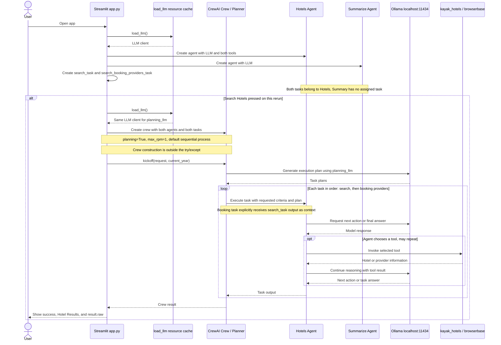

* Build an Agentic workflow that parses a travel query, fetches live flights and hotel data from Kayak, and summarizes the best options. 
* Tech stack: 
  * CrewAI for multi-agent orchestration 
  * Browserbase’s headless browser tool 
  * Ollama to locally serve DeepSeek-R1 
* Workflow: 
  * Parse the query (location, dates etc.) to create a Kayak search URL 
  * Visit the URL and extract top 5 flights 
  * For each hotel, find pricing and more info 
  * Summarize hotel info


* #2) Hotel Search Agent - This agent mimics a real human searching for hotels by browsing the web. It's powered by browserbase's headless-browser tool and can look up hotels on sites like Kayak.
  ``` hotels_agent = Agent( search_task = Task( ```

* #3) Summarisation Agent - After retrieving the hotel details, concise summary of all available options. This is where our Summarization Agent steps in to make sense of the results for easy reading.
  ``` summarize_agent = Agent( search_booking_providers_task = Task( ```

* #4) Kayak tool (kayak.py) - A custom Kayak tool to translate the user input into a valid Kayak search URL. (FYI Kayak is a popular for hotel and fight booking)

* #5) Browserbase Tool (browserbase.py) - The hotel search agent uses the Browserbase tool to simulate human browsing and gather hotel data. To be precise it automatically navigates the Kayak website and interacts with the web page.




* Tool calls are model-selected, not guaranteed.
* External behavior inside the imported tools is outside this diagram's scope.
* Exceptions during imports, agent initialization, or crew construction are not caught by the search handler.
