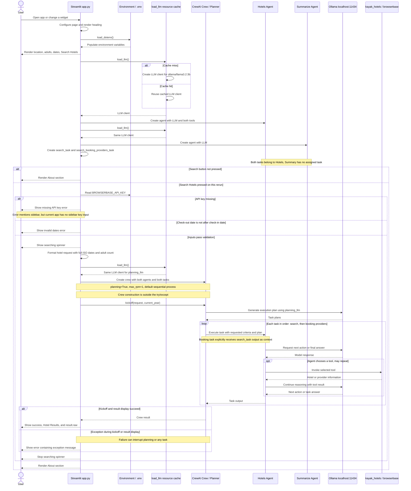

* Build an Agentic workflow that parses a travel query, fetches live flights and hotel data from Kayak, and summarizes the best options. 
* Tech stack: 
  * CrewAI for multi-agent orchestration 
  * Browserbase’s headless browser tool 
  * Ollama to locally serve DeepSeek-R1 
* Workflow: 
  * Parse the query (location, dates etc.) to create a Kayak search URL 
  * Visit the URL and extract top 5 flights 
  * For each hotel, find pricing and more info 
  * Summarize hotel info

# HotelFinder Pro Sequence Diagram

Flow of `app.py`. Streamlit reruns the script when widgets change; the LLM resource is reused across reruns.

* Tool calls are model-selected, not guaranteed.
* External behavior inside the imported tools is outside this diagram's scope.
* Exceptions during imports, agent initialization, or crew construction are not caught by the search handler.
