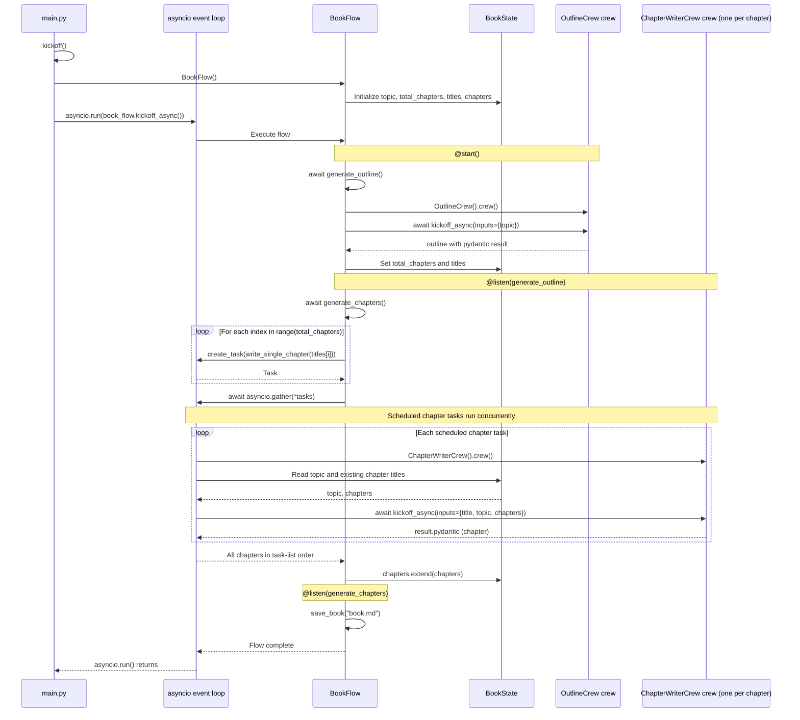

* Build an Agentic workflow that writes a 20k-word book from a 3-5 word book title. 
* Tech stack: 
  * Firecrawl for web scraping. 
  * CrewAI for orchestration. 
  * Ollama to serve Qwen 3 locally. 
  * LightningAI for development and hosting 
* Workflow: 
  * Using Firecrawl, Outline Crew scrapes data related to the book title and decides the chapter count and titles. 
  * Multiple writer Crews work in parallel to write one chapter each. 
  * Combine all chapters to get the book.

* #1) Scraping tool (custom_tools.py) - Books demand research, use Firecrawl's SERP API to scrape data. 
  * Tool usage: 
    * Outline Crew → to research the book title and prepare an outline. 
    * Writer Crew → to research the chapter title and write it. 

* #3) Outline Crew (outline_crew.py) - This Crew has two Agents: 
  * Research Agent → Uses the Firecrawl scraping tool to scrape data related to the book's title and prepare insights. 
  * Outline Agent → Uses the insights to output total chapters and titles as Pydantic output. 

* #4) Writer Crew (writer_crew.py) - This Crew has two Agents: 
  * Research Agent → Uses the Firecrawl Scraping tool to scrape data related to a chapter's title and prepare insights. 
  * Write Agent → Uses the insights to write a chapter.

* #5) Create a Flow - CrewAI Flows to orchestrate the workflow. The outline method invokes the Outline Crew, which: 
    * research the topic using the scraping tool. 
    * returns the total number of chapters and the corresponding titles. 

  

